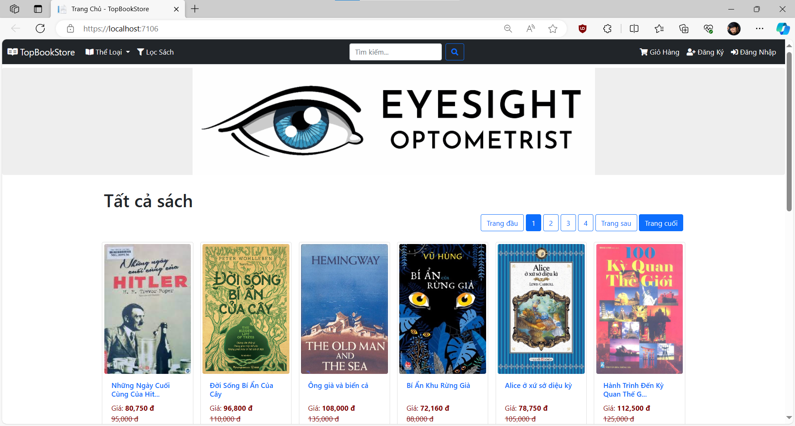

# TopBookStore .NET Clean Architecture

## Overview

TopBookStore is a .NET application built using the clean architecture principles. It aims to provide a clean and modular structure for developing a bookstore application.

The clean architecture promotes separation of concerns and maintainability by organizing the application into layers based on their level of abstraction. It emphasizes loose coupling between layers and focuses on the flow of data and dependencies.

The TopBookStore homepage should look like this:



## Getting Started

To run the TopBookStore project locally, you need to follow these steps:

1. Clone the repository.

```powershell
git clone https://github.com/keilar000/TopBookStore.git
```

2. Configure the database connection string, in **TopBookStore.Mvc** find the file called **appsetting.json** and check the connection string, you may need to change the connection string. For example, if you are using SQL Express, the connection string would be: 

```powershell
Server=.\\sqlexpress;Database=TopBookStore;MultipleActiveResultSets=true;Trusted_Connection=True;
```

3. Set up the database, to set up the database you need to follow either one of these steps:

- If you use Visual Studio, open the Package Manager Console in **Infrastructure** layer  and run the following command.

```powershell
Update-Database -Context IdentityTopBookStoreDbContext
```

- If you use Visual Studio Code, open your terminal in **Infrastructure** layer and run the command.

```powershell
dotnet ef database update --context IdentityTopBookStoreDbContext --startup-project ..\TopBookStore.Mvc\TopBookStore.Mvc.csproj
```

4. Build and run the application.

## Project Structure

The TopBookStore project follows a typical clean architecture structure with the following layers:

1. **Presentation Layer**: This layer represents the user interfaces, such as MVC or API controllers, views, or command-line interfaces. It interacts with the application through use cases, typically via dependency injection.

2. **Application Layer**: This layer contains the application logic and orchestrates the flow of data. It defines use cases or application services that encapsulate the business rules and acts as an intermediary between the presentation and domain layers.

3. **Domain Layer**: The domain layer encapsulates the core business logic and entities of the application. It defines the business models, aggregates, and domain services. This layer is independent of any infrastructure concerns.

4. **Infrastructure Layer**: This layer provides implementations for external dependencies and infrastructure concerns. It includes data access, external services, logging, configuration, and other infrastructure-related details. It should be designed to be pluggable and easily swappable.

## Technologies Used

The TopBookStore project utilizes the following technologies:

- **Programming Language**: C# 11 (.NET 7)
- **Web Framework**: ASP.NET Core MVC
- **Database**: Entity Framework Core (ORM)
- **Dependency Injection**: Microsoft.Extensions.DependencyInjection
- **Serialization**: JSON for data exchange

## License

The TopBookStore project is open-source and released under the [MIT License](https://opensource.org/licenses/MIT). You are free to use, modify, and distribute the codebase as per the license terms.

## Conclusion

The TopBookStore project is an example of a .NET application built using the clean architecture principles. It provides a clear separation of concerns, promotes maintainability, and encourages modularity. With its layered structure, it enables developers to focus on specific aspects of the application while keeping a well-defined architecture.